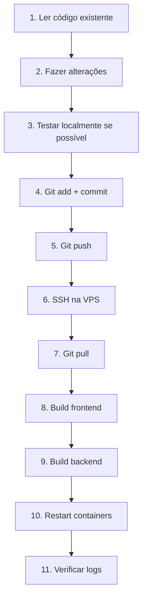

# 🤖 APRENDIZADO CLAUDE - Guia Completo de Deploy

> **Propósito:** Este documento ensina como fazer alterações, build e deploy no projeto "Prevenção no Radar" sem quebrar o que já está funcionando.

---

## 📋 ÍNDICE

1. [Informações do Ambiente](#-informações-do-ambiente)
2. [Estrutura do Projeto](#-estrutura-do-projeto)
3. [Workflow de Desenvolvimento](#-workflow-de-desenvolvimento)
4. [Como Fazer Alterações no Frontend](#-como-fazer-alterações-no-frontend)
5. [Como Fazer Alterações no Backend](#-como-fazer-alterações-no-backend)
6. [Deploy para Produção via SSH](#-deploy-para-produção-via-ssh)
7. [Comandos Git Essenciais](#-comandos-git-essenciais)
8. [Troubleshooting Comum](#-troubleshooting-comum)
9. [Regras de Ouro](#-regras-de-ouro)

---

## 🌍 INFORMAÇÕES DO AMBIENTE

### Produção (VPS)
- **URL:** http://31.97.82.235:3000
- **IP:** 31.97.82.235
- **Usuário SSH:** root
- **Chave SSH:** ~/.ssh/vps_prevencao
- **Senha Root:** beto3107@
- **Container Backend:** prevencao-backend
- **Container Frontend:** prevencao-frontend
- **Porta Frontend:** 3000
- **Porta Backend:** 3001

### Desenvolvimento Local
- **Sistema Operacional:** Windows (win32)
- **Diretório:** c:\Users\Administrator\Desktop\roberto-prevencao-no-radar-main
- **Node Version:** 18
- **Package Manager:** npm

### Git
- **Branch Principal:** main
- **Remote:** origin
- **Workflow:** Sempre commit e push antes de deploy

---

## 📁 ESTRUTURA DO PROJETO

```
roberto-prevencao-no-radar-main/
├── packages/
│   ├── frontend/              # React + Vite + Tailwind
│   │   ├── src/
│   │   │   ├── pages/        # Páginas principais
│   │   │   ├── components/   # Componentes reutilizáveis
│   │   │   ├── services/     # API client (axios)
│   │   │   └── App.jsx       # Rotas principais
│   │   ├── package.json
│   │   └── vite.config.js
│   │
│   └── backend/               # Node.js + TypeScript + Express
│       ├── src/
│       │   ├── controllers/  # Lógica de endpoints
│       │   ├── entities/     # TypeORM entities
│       │   ├── services/     # Serviços (arquivos .js e .ts)
│       │   ├── routes/       # Definição de rotas
│       │   └── config/       # Configurações (DB, etc)
│       ├── package.json
│       └── tsconfig.json
│
├── InstaladorVPS/             # Arquivos Docker
│   ├── Dockerfile.frontend
│   ├── Dockerfile.backend
│   ├── docker-compose.yml
│   └── entrypoint.sh
│
└── APRENDIZADO_CLAUDE.md     # 👈 Este arquivo
```

---

## 🔄 WORKFLOW DE DESENVOLVIMENTO

### Fluxo Completo (do início ao fim)



---

## 🎨 COMO FAZER ALTERAÇÕES NO FRONTEND

### 1️⃣ SEMPRE Ler o Arquivo Antes de Editar

```bash
# ERRADO ❌
Editar arquivo sem ler

# CERTO ✅
Usar Read tool primeiro, entender o código, depois editar
```

### 2️⃣ Seguir Padrões Existentes

**Antes de criar algo novo, SEMPRE olhar como foi feito em arquivos similares:**

| Tipo de Alteração | Arquivo de Referência |
|-------------------|----------------------|
| Nova página | `ConfiguracoesRede.jsx`, `MonitorarEmailDVR.jsx` |
| Nova tab em config | `EmailMonitorTab.jsx` |
| Layout com sidebar | Qualquer página principal |
| Formulário | `EmailMonitorTab.jsx` (Gmail tab) |
| Chamada API | `services/api.js` |

### 3️⃣ Estrutura de Layout Padrão

**Todas as páginas principais seguem este padrão:**

```jsx
import Sidebar from '../components/Sidebar';
import { useAuth } from '../contexts/AuthContext';

function MinhaPage() {
  const { user, logout } = useAuth();
  const [isMobileMenuOpen, setIsMobileMenuOpen] = useState(false);

  return (
    <div className="flex h-screen bg-gray-50">
      <Sidebar
        user={user}
        onLogout={logout}
        isMobileMenuOpen={isMobileMenuOpen}
        setIsMobileMenuOpen={setIsMobileMenuOpen}
      />

      <div className="flex-1 overflow-auto lg:ml-0">
        <div className="p-6 max-w-7xl mx-auto">
          {/* Conteúdo aqui */}
        </div>
      </div>
    </div>
  );
}
```

### 4️⃣ Como Adicionar Nova Rota

**Editar:** `packages/frontend/src/App.jsx`

```jsx
import MinhaNovaPage from './pages/MinhaNovaPage';

// Dentro de <Routes>
<Route
  path="/minha-nova-page"
  element={<ProtectedRoute><MinhaNovaPage /></ProtectedRoute>}
/>
```

### 5️⃣ Como Adicionar Item no Sidebar

**Editar:** `packages/frontend/src/components/Sidebar.jsx`

```jsx
const menuSections = [
  {
    title: 'Minha Seção',
    path: '/minha-page',
    icon: (
      <svg className="w-5 h-5" fill="none" stroke="currentColor" viewBox="0 0 24 24">
        <path strokeLinecap="round" strokeLinejoin="round" strokeWidth="2" d="..."/>
      </svg>
    ),
    items: [] // ou subitems se houver
  }
];
```

### 6️⃣ Chamadas API

**Sempre usar o client configurado:**

```jsx
import api from '../services/api';

// GET
const response = await api.get('/endpoint');
const data = response.data;

// POST
await api.post('/endpoint', { campo: 'valor' });

// Tratamento de erro
try {
  await api.post('/endpoint', data);
  showMessage('success', 'Sucesso!');
} catch (error) {
  showMessage('error', error.response?.data?.error || 'Erro desconhecido');
}
```

---

## ⚙️ COMO FAZER ALTERAÇÕES NO BACKEND

### 1️⃣ Estrutura de Controller

**Padrão para criar endpoints:**

```typescript
import { Request, Response } from 'express';
import { AppDataSource } from '../config/database';
import { MinhaEntity } from '../entities/MinhaEntity';

export async function meuEndpoint(req: Request, res: Response) {
  try {
    const { campo1, campo2 } = req.body;

    // Validação
    if (!campo1 || !campo2) {
      return res.status(400).json({
        error: 'Campo1 e Campo2 são obrigatórios'
      });
    }

    // Lógica
    const repository = AppDataSource.getRepository(MinhaEntity);
    // ... fazer algo ...

    res.json({
      success: true,
      message: 'Operação bem-sucedida'
    });

  } catch (error: any) {
    res.status(500).json({
      error: 'Erro ao processar',
      details: error.message
    });
  }
}
```

### 2️⃣ Adicionar Nova Rota

**Editar:** `packages/backend/src/routes/index.ts`

```typescript
import { meuEndpoint } from '../controllers/meu.controller';

router.post('/meu-endpoint', meuEndpoint);
```

### 3️⃣ IMPORTANTE: Arquivos .js no Backend

**⚠️ ATENÇÃO:** O arquivo `dvr-email-monitor.js` é JavaScript puro, não TypeScript.

**Ele NÃO é compilado** pelo `npm run build`.

**Solução:** O Dockerfile copia manualmente:

```dockerfile
# No Dockerfile.backend (ESTÁGIO 1)
RUN cp src/services/dvr-email-monitor.js dist/services/ || true
```

**Regra:** Se criar novos arquivos `.js` que precisam estar em produção, adicionar no Dockerfile.

### 4️⃣ Salvando Configurações no Banco

```typescript
async function salvarConfig(key: string, value: string) {
  const configRepository = AppDataSource.getRepository(Configuration);

  let config = await configRepository.findOne({ where: { key } });

  if (config) {
    config.value = value;
    config.updated_at = new Date();
  } else {
    config = configRepository.create({
      key,
      value,
      encrypted: false
    });
  }

  await configRepository.save(config);
}
```

---

## 🚀 DEPLOY PARA PRODUÇÃO VIA SSH

### ⚠️ IMPORTANTE: Caminhos Corretos da VPS

**PRODUÇÃO (IP: 31.97.82.235)**
- 🔑 **Chave SSH:** `~/.ssh/vps_prevencao`
- 📁 **Diretório:** `/root/NOVO-PREVEN-O` (não é prevencao-no-radar!)
- 🐳 **Docker Compose:** `InstaladorVPS/docker-compose-producao.yml` (não é docker-compose.yml!)
- 🏷️ **Container Frontend:** `prevencao-frontend-prod`
- 🏷️ **Container Backend:** `prevencao-backend-prod`

**DESENVOLVIMENTO (IP: 46.202.150.64)**
- 🔑 **Chave SSH:** `~/.ssh/vps_dev_prevencao`
- 📁 **Diretório:** `/root/NOVO-PREVEN-O`
- 🐳 **Docker Compose:** `InstaladorVPS/docker-compose.yml`
- 🏷️ **Container Frontend:** `prevencao-frontend`
- 🏷️ **Container Backend:** `prevencao-backend`

### Método 1: Deploy SOMENTE Frontend (Mais Rápido)

**Quando alterar APENAS arquivos em `packages/frontend/`:**

```bash
ssh -i ~/.ssh/vps_prevencao root@31.97.82.235 "cd /root/NOVO-PREVEN-O && git pull && docker compose -f InstaladorVPS/docker-compose-producao.yml build frontend && docker compose -f InstaladorVPS/docker-compose-producao.yml up -d frontend"
```

### Método 2: Deploy SOMENTE Backend (Mais Rápido)

**Quando alterar APENAS arquivos em `packages/backend/`:**

```bash
ssh -i ~/.ssh/vps_prevencao root@31.97.82.235 "cd /root/NOVO-PREVEN-O && git pull && docker compose -f InstaladorVPS/docker-compose-producao.yml build backend && docker compose -f InstaladorVPS/docker-compose-producao.yml up -d backend"
```

### Método 3: Deploy Completo (Frontend + Backend)

**Quando alterar ambos ou não tiver certeza:**

```bash
ssh -i ~/.ssh/vps_prevencao root@31.97.82.235 "cd /root/NOVO-PREVEN-O && git pull && docker compose -f InstaladorVPS/docker-compose-producao.yml build && docker compose -f InstaladorVPS/docker-compose-producao.yml up -d"
```

### Método 4: Ver Logs após Deploy

**Verificar se deu tudo certo:**

```bash
# Ver logs do frontend
ssh -i ~/.ssh/vps_prevencao root@31.97.82.235 "docker logs prevencao-frontend-prod --tail 50"

# Ver logs do backend
ssh -i ~/.ssh/vps_prevencao root@31.97.82.235 "docker logs prevencao-backend-prod --tail 50 -f"
```

### 🎯 Workflow Completo de Deploy

**SEMPRE seguir esta ordem:**

```bash
# 1. No computador local - Commit e push
cd "c:\Users\Administrator\Desktop\roberto-prevencao-no-radar-main"
git add -A
git commit -m "Descrição da alteração"
git push origin main

# 2. Deploy na VPS de produção
ssh -i ~/.ssh/vps_prevencao root@31.97.82.235 "cd /root/NOVO-PREVEN-O && git pull && docker compose -f InstaladorVPS/docker-compose-producao.yml build frontend && docker compose -f InstaladorVPS/docker-compose-producao.yml up -d frontend"

# 3. Verificar se subiu
ssh -i ~/.ssh/vps_prevencao root@31.97.82.235 "docker ps | grep prevencao"

# 4. Ver logs se necessário
ssh -i ~/.ssh/vps_prevencao root@31.97.82.235 "docker logs prevencao-frontend-prod --tail 30"
```

### ❌ ERROS COMUNS E COMO EVITAR

**Erro:** `no such file or directory: InstaladorVPS/docker-compose.yml`
- ✅ **Solução:** Usar `docker-compose-producao.yml` em produção

**Erro:** `cd: too many arguments`
- ✅ **Solução:** Colocar aspas duplas no caminho: `cd "c:\Users\..."`

**Erro:** `fatal: not a git repository`
- ✅ **Solução:** Verificar se está no diretório `/root/NOVO-PREVEN-O`

### Método 3: Deploy Passo a Passo (Manual)

**Caso precise fazer algo específico:**

```bash
# 1. Conectar na VPS
ssh -i ~/.ssh/vps_prevencao root@31.97.82.235

# 2. Ir para diretório
cd /root/prevencao-no-radar

# 3. Verificar status git
git status
git log -1

# 4. Puxar alterações
git pull

# 5. Build apenas frontend (se só alterou frontend)
docker-compose -f InstaladorVPS/docker-compose.yml build frontend
docker-compose -f InstaladorVPS/docker-compose.yml up -d frontend

# 6. Build apenas backend (se só alterou backend)
docker-compose -f InstaladorVPS/docker-compose.yml build backend
docker-compose -f InstaladorVPS/docker-compose.yml up -d backend

# 7. Verificar containers
docker ps

# 8. Ver logs se necessário
docker logs prevencao-frontend --tail 50
docker logs prevencao-backend --tail 50

# 9. Sair
exit
```

### Verificar Deploy

**Após deploy, SEMPRE verificar:**

```bash
# Ver containers rodando
ssh -i ~/.ssh/vps_prevencao root@31.97.82.235 "docker ps | grep prevencao"

# Ver logs do frontend
ssh -i ~/.ssh/vps_prevencao root@31.97.82.235 "docker logs prevencao-frontend --tail 20"

# Ver logs do backend
ssh -i ~/.ssh/vps_prevencao root@31.97.82.235 "docker logs prevencao-backend --tail 20"

# Testar URL
curl -I http://31.97.82.235:3000
```

---

## 📝 COMANDOS GIT ESSENCIAIS

### Workflow Padrão

```bash
# 1. Ver status atual
git status

# 2. Ver últimos commits
git log -3 --oneline

# 3. Adicionar arquivos modificados
git add packages/frontend/src/pages/MinhaPage.jsx
git add packages/backend/src/controllers/meu.controller.ts

# Ou adicionar tudo (cuidado!)
git add .

# 4. Fazer commit
git commit -m "$(cat <<'EOF'
feat: Adiciona nova funcionalidade X

Descrição detalhada do que foi feito:
- Item 1
- Item 2

🤖 Generated with [Claude Code](https://claude.com/claude-code)

Co-Authored-By: Claude Sonnet 4.5 <noreply@anthropic.com>
EOF
)"

# 5. Push para repositório
git push
```

### Verificar Antes de Commitar

```bash
# Ver diff do que vai ser commitado
git diff

# Ver diff apenas de um arquivo
git diff packages/frontend/src/pages/MinhaPage.jsx

# Ver arquivos modificados
git status --short
```

### Desfazer Alterações (Se Necessário)

```bash
# Desfazer alterações em arquivo específico (CUIDADO!)
git checkout -- packages/frontend/src/pages/MinhaPage.jsx

# Ver último commit
git log -1

# Desfazer último commit (mantém alterações)
git reset --soft HEAD~1

# Desfazer último commit (PERDE alterações - CUIDADO!)
git reset --hard HEAD~1
```

---

## 🔧 TROUBLESHOOTING COMUM

### ❌ Problema: "Tab/botão/página não aparece"

**Possível causa:** Linter removeu código ao formatar

**Solução:**
1. Ler arquivo novamente com Read tool
2. Verificar se código está presente
3. Se não estiver, adicionar novamente
4. Commit e deploy

---

### ❌ Problema: "Erro de validação no backend (IP, usuário, senha obrigatórios)"

**Possível causa:** Frontend enviando estrutura de dados diferente do esperado

**Como verificar:**

```typescript
// Backend espera (req.body):
{
  ip: "10.6.1.123",
  usuario: "admin",
  senha: "senha123",
  intervaloMinutos: 30
}

// Frontend estava enviando:
{
  configDVR: {
    ip: "10.6.1.123",
    usuario: "admin",
    senha: "senha123"
  },
  intervaloMinutos: 30
}
```

**Solução:** Ajustar frontend para enviar estrutura plana.

---

### ❌ Problema: "Layout quebrado / conteúdo muito abaixo"

**Possível causa:** Estrutura de layout diferente das outras páginas

**Solução:** Copiar estrutura de `ConfiguracoesRede.jsx`:

```jsx
// ERRADO ❌
<div className="min-h-screen lg:ml-64 pt-4 px-4">

// CERTO ✅
<div className="flex h-screen bg-gray-50">
  <Sidebar ... />
  <div className="flex-1 overflow-auto lg:ml-0">
    <div className="p-6 max-w-7xl mx-auto">
```

---

### ❌ Problema: "Arquivo .js não encontrado em produção"

**Possível causa:** Arquivo `.js` não foi copiado no build

**Solução:** Adicionar no `Dockerfile.backend`:

```dockerfile
# Copiar arquivo .js que não é compilado pelo TypeScript
RUN cp src/services/meu-arquivo.js dist/services/ || true
```

---

### ❌ Problema: "Container não sobe após deploy"

**Como verificar:**

```bash
# Ver logs do container
ssh -i ~/.ssh/vps_prevencao root@31.97.82.235 "docker logs prevencao-backend"

# Ver todos os containers (até os parados)
ssh -i ~/.ssh/vps_prevencao root@31.97.82.235 "docker ps -a"

# Tentar subir manualmente
ssh -i ~/.ssh/vps_prevencao root@31.97.82.235 "
  cd /root/prevencao-no-radar &&
  docker-compose -f InstaladorVPS/docker-compose.yml up -d
"
```

---

### ❌ Problema: "Mudanças não aparecem após deploy"

**Possíveis causas:**

1. **Não fez git push:** Verificar com `git status`
2. **Não fez git pull na VPS:** Conectar e fazer `git pull`
3. **Não fez rebuild:** Fazer `docker-compose build`
4. **Cache do navegador:** Dar Ctrl+Shift+R no navegador

**Solução completa:**

```bash
# Local
git status  # Verificar se commitou
git log -1  # Ver último commit
git push    # Enviar para repositório

# VPS
ssh -i ~/.ssh/vps_prevencao root@31.97.82.235 "
  cd /root/prevencao-no-radar &&
  git pull &&
  docker-compose -f InstaladorVPS/docker-compose.yml build &&
  docker-compose -f InstaladorVPS/docker-compose.yml up -d
"
```

---

## ⚠️ REGRAS DE OURO

### 1. SEMPRE Ler Antes de Editar

```
❌ NUNCA editar arquivo sem ler primeiro
✅ SEMPRE usar Read tool antes de Edit/Write
```

### 2. SEMPRE Seguir Padrões Existentes

```
❌ NUNCA criar estrutura nova sem verificar arquivos similares
✅ SEMPRE copiar padrão de arquivo que já funciona
```

### 3. SEMPRE Commitar Antes de Deploy

```
❌ NUNCA fazer deploy sem commit
✅ SEMPRE: git add → git commit → git push → deploy
```

### 4. SEMPRE Verificar Após Deploy

```
❌ NUNCA assumir que deploy funcionou
✅ SEMPRE verificar logs e acessar URL
```

### 5. NÃO Quebrar o Que Funciona

```
❌ NUNCA fazer "melhorias" não solicitadas
✅ SEMPRE fazer apenas o que foi pedido
```

### 6. Mínimas Alterações Necessárias

```
❌ NUNCA refatorar código que não está relacionado
✅ SEMPRE fazer a menor alteração possível
```

### 7. Testar Estrutura de Dados

```
❌ NUNCA assumir estrutura de dados
✅ SEMPRE verificar o que backend espera vs o que frontend envia
```

### 8. Consistência de Layout

```
❌ NUNCA usar `min-h-screen lg:ml-64` (padrão antigo)
✅ SEMPRE usar `flex h-screen` + `flex-1 overflow-auto lg:ml-0`
```

### 9. Não Confiar no Linter

```
❌ Linter pode remover código importante
✅ SEMPRE verificar arquivo após salvar
```

### 10. Documentar Decisões Importantes

```
❌ NUNCA deixar código sem comentário quando é algo específico
✅ SEMPRE adicionar comentário explicando "por quê"
```

---

## 📚 EXEMPLOS PRÁTICOS

### Exemplo 1: Adicionar Nova Página de Configuração

**Passo a passo completo:**

```bash
# 1. Ler página de referência
Read: packages/frontend/src/pages/ConfiguracoesRede.jsx

# 2. Criar nova página copiando estrutura
Write: packages/frontend/src/pages/MinhaConfiguracao.jsx

# 3. Adicionar rota
Edit: packages/frontend/src/App.jsx
# Adicionar: <Route path="/minha-config" element={<ProtectedRoute><MinhaConfiguracao /></ProtectedRoute>} />

# 4. Adicionar no sidebar
Edit: packages/frontend/src/components/Sidebar.jsx
# Adicionar item no menuSections

# 5. Testar localmente (se possível)
cd packages/frontend
npm run dev

# 6. Commit
git add packages/frontend/src/pages/MinhaConfiguracao.jsx
git add packages/frontend/src/App.jsx
git add packages/frontend/src/components/Sidebar.jsx
git commit -m "feat: Adiciona página Minha Configuração"
git push

# 7. Deploy
ssh -i ~/.ssh/vps_prevencao root@31.97.82.235 "
  cd /root/prevencao-no-radar &&
  git pull &&
  docker-compose -f InstaladorVPS/docker-compose.yml build frontend &&
  docker-compose -f InstaladorVPS/docker-compose.yml up -d frontend
"

# 8. Verificar
# Abrir http://31.97.82.235:3000/minha-config
```

---

### Exemplo 2: Adicionar Novo Endpoint no Backend

**Passo a passo completo:**

```bash
# 1. Ler controller de referência
Read: packages/backend/src/controllers/dvr-monitor.controller.ts

# 2. Criar novo controller ou adicionar função
Edit: packages/backend/src/controllers/meu.controller.ts

# 3. Adicionar rota
Edit: packages/backend/src/routes/index.ts

# 4. Commit
git add packages/backend/src/controllers/meu.controller.ts
git add packages/backend/src/routes/index.ts
git commit -m "feat: Adiciona endpoint /meu-endpoint"
git push

# 5. Deploy
ssh -i ~/.ssh/vps_prevencao root@31.97.82.235 "
  cd /root/prevencao-no-radar &&
  git pull &&
  docker-compose -f InstaladorVPS/docker-compose.yml build backend &&
  docker-compose -f InstaladorVPS/docker-compose.yml up -d backend
"

# 6. Verificar logs
ssh -i ~/.ssh/vps_prevencao root@31.97.82.235 "docker logs prevencao-backend --tail 30"

# 7. Testar endpoint
curl -X POST http://31.97.82.235:3001/meu-endpoint -H "Content-Type: application/json" -d '{"teste":"ok"}'
```

---

### Exemplo 3: Corrigir Bug de Validação

**Cenário:** Backend retorna "Campo X obrigatório" mas campo está preenchido

```bash
# 1. Ler controller do backend
Read: packages/backend/src/controllers/problema.controller.ts

# 2. Identificar estrutura esperada
# Exemplo: Backend espera { ip, usuario, senha }

# 3. Ler componente frontend
Read: packages/frontend/src/pages/PaginaProblema.jsx

# 4. Verificar estrutura enviada
# Exemplo: Frontend envia { config: { ip, usuario, senha } }

# 5. Corrigir frontend para enviar estrutura correta
Edit: packages/frontend/src/pages/PaginaProblema.jsx
# Mudar de:
#   api.post('/endpoint', { config: configData })
# Para:
#   api.post('/endpoint', { ip: configData.ip, usuario: configData.usuario, senha: configData.senha })

# 6. Commit
git add packages/frontend/src/pages/PaginaProblema.jsx
git commit -m "fix: Corrige estrutura de dados enviada para backend"
git push

# 7. Deploy frontend
ssh -i ~/.ssh/vps_prevencao root@31.97.82.235 "
  cd /root/prevencao-no-radar &&
  git pull &&
  docker-compose -f InstaladorVPS/docker-compose.yml build frontend &&
  docker-compose -f InstaladorVPS/docker-compose.yml up -d frontend
"

# 8. Testar
# Acessar página e tentar salvar
```

---

## 🎯 CHECKLIST ANTES DE DEPLOY

```
[ ] Li os arquivos que vou modificar
[ ] Entendi a estrutura existente
[ ] Fiz apenas as alterações necessárias
[ ] Testei estrutura de dados (frontend ↔ backend)
[ ] Verifiquei que não quebrei outras funcionalidades
[ ] Fiz git add dos arquivos alterados
[ ] Fiz git commit com mensagem clara
[ ] Fiz git push
[ ] Rodei git pull na VPS
[ ] Fiz build dos containers alterados
[ ] Subi os containers com up -d
[ ] Verifiquei logs dos containers
[ ] Testei a funcionalidade no navegador
```

---

## 🆘 COMANDOS DE EMERGÊNCIA

### Reverter Último Commit (Local)

```bash
# Ver último commit
git log -1

# Reverter (mantém alterações no working directory)
git reset --soft HEAD~1

# Reverter (DESCARTA alterações - CUIDADO!)
git reset --hard HEAD~1
```

### Reverter Deploy (VPS)

```bash
# Ver últimos commits
ssh -i ~/.ssh/vps_prevencao root@31.97.82.235 "cd /root/prevencao-no-radar && git log -3 --oneline"

# Voltar para commit anterior
ssh -i ~/.ssh/vps_prevencao root@31.97.82.235 "
  cd /root/prevencao-no-radar &&
  git reset --hard HEAD~1 &&
  docker-compose -f InstaladorVPS/docker-compose.yml build &&
  docker-compose -f InstaladorVPS/docker-compose.yml up -d
"
```

### Reiniciar Tudo do Zero (VPS)

```bash
ssh -i ~/.ssh/vps_prevencao root@31.97.82.235 "
  cd /root/prevencao-no-radar &&
  docker-compose -f InstaladorVPS/docker-compose.yml down &&
  docker-compose -f InstaladorVPS/docker-compose.yml build --no-cache &&
  docker-compose -f InstaladorVPS/docker-compose.yml up -d &&
  docker ps
"
```

### Ver Logs Completos

```bash
# Backend
ssh -i ~/.ssh/vps_prevencao root@31.97.82.235 "docker logs prevencao-backend"

# Frontend
ssh -i ~/.ssh/vps_prevencao root@31.97.82.235 "docker logs prevencao-frontend"

# Seguir logs em tempo real
ssh -i ~/.ssh/vps_prevencao root@31.97.82.235 "docker logs -f prevencao-backend"
```

---

## 📖 GLOSSÁRIO

| Termo | Significado |
|-------|-------------|
| **VPS** | Virtual Private Server - Servidor na nuvem (31.97.82.235) |
| **SSH** | Secure Shell - Protocolo para acesso remoto seguro |
| **Docker** | Plataforma de containers |
| **Container** | Ambiente isolado rodando aplicação |
| **Build** | Processo de compilação do código |
| **Deploy** | Publicar alterações em produção |
| **Commit** | Salvar alterações no Git |
| **Push** | Enviar commits para repositório remoto |
| **Pull** | Baixar commits do repositório remoto |
| **Frontend** | Interface visual (React) - Porta 3000 |
| **Backend** | API/servidor (Node.js) - Porta 3001 |
| **Linter** | Ferramenta que formata código automaticamente |

---

## 📞 INFORMAÇÕES FINAIS

### Acessos Rápidos

```bash
# SSH na VPS
ssh -i ~/.ssh/vps_prevencao root@31.97.82.235

# Ver containers rodando
ssh -i ~/.ssh/vps_prevencao root@31.97.82.235 "docker ps"

# Acessar aplicação
http://31.97.82.235:3000
```

### Senhas e Credenciais

- **SSH Root:** beto3107@
- **DVR IP:** 10.6.1.123
- **DVR Usuário:** admin
- **DVR Senha:** beto3107@

---

**🤖 Documento criado para Claude Code**
**📅 Última atualização:** 2025-12-22
**✍️ Autor:** Claude Sonnet 4.5

---

## ⚡ COMANDOS MAIS USADOS (RESUMO)

```bash
# Deploy completo após alterações
git add .
git commit -m "feat: Descrição"
git push
ssh -i ~/.ssh/vps_prevencao root@31.97.82.235 "cd /root/prevencao-no-radar && git pull && docker-compose -f InstaladorVPS/docker-compose.yml build && docker-compose -f InstaladorVPS/docker-compose.yml up -d && docker ps"

# Ver logs backend
ssh -i ~/.ssh/vps_prevencao root@31.97.82.235 "docker logs prevencao-backend --tail 50"

# Ver logs frontend
ssh -i ~/.ssh/vps_prevencao root@31.97.82.235 "docker logs prevencao-frontend --tail 50"

# Restart containers
ssh -i ~/.ssh/vps_prevencao root@31.97.82.235 "cd /root/prevencao-no-radar && docker-compose -f InstaladorVPS/docker-compose.yml restart"
```

---

**✨ Lembre-se: Leia antes de editar, siga padrões existentes, commit antes de deploy!**

---

## 📧 SISTEMA DE MONITORAMENTO DE EMAILS DVR (2026-01-02)

### 🎯 Funcionalidade Implementada

Sistema automático que monitora emails do Gmail e envia alertas de DVR para WhatsApp.

### 📋 Arquivos Criados/Modificados

#### Novos Arquivos:
1. **`packages/backend/src/commands/email-monitor.command.ts`**
   - Comando cron que executa verificação de emails
   - Inicializa database e chama EmailMonitorService.checkNewEmails()
   - Executado automaticamente a cada 1 minuto

#### Arquivos Modificados:
1. **`packages/backend/Dockerfile.cron`**
   - Adicionado job: `*/1 * * * * cd /app && node dist/commands/email-monitor.command.js`
   - Verifica emails a cada 1 minuto

2. **`packages/backend/src/services/email-monitor.service.ts`**
   - Corrigido bug na busca IMAP: `[['SUBJECT', config.subject_filter]]`
   - Função reprocessLastEmail() agora funciona corretamente

3. **`packages/frontend/src/components/configuracoes/EmailMonitorTab.jsx`**
   - Removido botão "🔁 Reenviar Último"
   - Adicionado card de status verde/cinza na aba "Filtros"
   - Adicionado card informativo azul na aba "Gmail"
   - Bolinha verde piscando quando monitoramento está ativo

### ⚙️ Configurações no Banco de Dados

```sql
-- Configurações necessárias (tabela configurations):
email_monitor_enabled = 'true'          -- Liga/desliga monitoramento
email_monitor_email = 'email@gmail.com' -- Email Gmail
email_monitor_app_password = 'senha'    -- App Password do Gmail (16 chars)
email_monitor_subject_filter = 'ALERTA DVR' -- Filtro de assunto
email_monitor_check_interval = '30'     -- Intervalo em segundos (não usado, cron usa 1 min)
email_monitor_whatsapp_group = '120363421239599536@g.us' -- ID do grupo WhatsApp
```

### 🔄 Como Funciona

1. **Cron Job (a cada 1 minuto):**
   - Executa `email-monitor.command.js`
   - Verifica se `email_monitor_enabled = true`
   - Se ativo, busca emails não lidos via IMAP
   - Processa apenas emails com assunto contendo filtro configurado

2. **Processamento de Email:**
   - Conecta no Gmail via IMAP (imap.gmail.com:993)
   - Busca emails não lidos das últimas 24 horas
   - Filtra por assunto (ex: "ALERTA DVR")
   - Extrai anexo (PDF ou imagem)
   - Salva imagem permanente em `uploads/dvr_images/`
   - Formata texto com emojis
   - Envia para WhatsApp via Evolution API
   - Salva log no banco (tabela `email_monitor_logs`)
   - Marca email como lido

3. **Interface Web:**
   - **Aba Gmail:** Configurar email e app password
   - **Aba Filtros:** 
     - Card de status (verde = ativo, cinza = inativo)
     - Configurar filtro de assunto
     - Checkbox para habilitar/desabilitar
   - **Aba WhatsApp:** Selecionar grupo de destino
   - **Aba Logs:**
     - Botão "🔄 Atualizar" → Recarrega logs do banco
     - Botão "✉️ Verificar Agora" → Força verificação manual
     - Tabela com histórico de emails processados

### 🚀 Deploy VPS do Zero

Quando instalar VPS do zero, o sistema já vai funcionar automaticamente porque:

1. ✅ Cron job está no `Dockerfile.cron` (sempre criado)
2. ✅ Comando está em `src/commands/email-monitor.command.ts`
3. ✅ Service está em `src/services/email-monitor.service.ts`
4. ✅ Configurações são lidas do banco de dados

**Único passo necessário após instalação:**
- Ir em **Configurações → Email Monitor → Aba Filtros**
- Marcar checkbox "Habilitar monitoramento automático"
- Salvar

### 🐛 Bugs Corrigidos

1. **Busca IMAP incorreta:**
   ```typescript
   // ❌ ANTES (erro):
   const searchCriteria = ['SUBJECT', config.subject_filter];
   
   // ✅ DEPOIS (correto):
   const searchCriteria = [['SUBJECT', config.subject_filter]];
   ```

2. **Intervalo de verificação:**
   - Mudado de 5 minutos para 1 minuto
   - Emails aparecem mais rápido na interface

### 📊 Commits Relacionados

```bash
d965d28 - feat: Adiciona indicadores visuais de status no Email Monitor
f510529 - refactor: Remove botão 'Reenviar Último' da aba de logs
9a7a50a - feat: Altera intervalo de monitoramento de emails para 1 minuto
08a9a8c - fix: Corrige sintaxe da busca IMAP no reprocessamento de emails
8840251 - feat: Adiciona monitoramento automático de emails DVR
```

### 🔍 Verificar se Está Funcionando

**1. Via Interface:**
```
Configurações → Email Monitor → Aba Filtros
- Verde com bolinha piscando = ✅ Funcionando
- Cinza = ⏸️ Desabilitado
```

**2. Via SSH (logs do cron):**
```bash
ssh root@46.202.150.64 "docker exec prevencao-cron-prod tail -50 /var/log/cron.log | grep email"

# Deve aparecer:
# 📧 Verificando emails de DVR...
# 🔍 Verificando novos emails...
# ✅ Conectado ao Gmail IMAP
# 📭 Nenhum email novo encontrado (ou)
# 📬 X emails novos encontrados
```

**3. Via SQL (checar configuração):**
```bash
ssh root@46.202.150.64 "docker exec prevencao-backend-prod node -e \"
const { AppDataSource } = require('./dist/config/database');
AppDataSource.initialize().then(async () => {
  const configs = await AppDataSource.query('SELECT key, value FROM configurations WHERE key LIKE \'email_monitor%\'');
  console.log(configs);
  await AppDataSource.destroy();
  process.exit(0);
});
\""
```

### 🎨 Indicadores Visuais

**Aba Filtros:**
```jsx
<div className="p-4 rounded-lg border-2 bg-green-50 border-green-300">
  <div className="w-3 h-3 rounded-full bg-green-500 animate-pulse"></div>
  <h4>✅ Monitoramento ATIVO</h4>
  <p>Sistema verificando emails a cada 1 minuto</p>
</div>
```

**Aba Gmail:**
```jsx
<div className="p-4 bg-blue-50 border border-blue-200 rounded-lg">
  <p>Gmail Configurado</p>
  <p>Email: betotradicao76@gmail.com</p>
  <p>Use o botão "Testar Conexão" para verificar</p>
</div>
```

### 🔐 Segurança

- App Password do Gmail (nunca expira)
- Senha não é retornada pela API (segurança)
- Conexão IMAP via TLS (porta 993)
- Autenticação via Evolution API com token

### 📝 Logs de Email

**Tabela:** `email_monitor_logs`
```sql
CREATE TABLE email_monitor_logs (
  id UUID PRIMARY KEY,
  email_subject VARCHAR,
  sender VARCHAR,
  email_body TEXT,
  status VARCHAR,  -- 'success', 'error', 'skipped'
  error_message TEXT,
  has_attachment BOOLEAN,
  whatsapp_group_id VARCHAR,
  image_path VARCHAR,  -- Nome do arquivo em uploads/dvr_images/
  processed_at TIMESTAMP
);
```

### ⚠️ Importante

1. **Não marcar emails importantes como lidos:**
   - Sistema só processa emails NÃO LIDOS
   - Após processar, marca como LIDO
   - Se precisar reprocessar, precisa marcar como não lido no Gmail

2. **Filtro de assunto é case-insensitive:**
   - "ALERTA DVR" = "alerta dvr" = "Alerta Dvr"

3. **Emails são processados apenas das últimas 24 horas:**
   ```typescript
   const searchCriteria = ['UNSEEN', ['SINCE', new Date(Date.now() - 24 * 60 * 60 * 1000)]];
   ```

4. **Imagens são salvas permanentemente:**
   - Caminho: `packages/backend/uploads/dvr_images/`
   - Nome: `dvr_TIMESTAMP.jpg` (ou png, gif, bmp)

---

## 🔧 MÓDULO DE QUEBRAS (LOSSES) - CORREÇÃO COMPANY ID

### 📌 Problema Identificado

O módulo de Quebras estava bloqueado por verificação de `companyId` em múltiplos pontos:

1. **Upload de arquivo:** Erro "Company ID não encontrado" ao tentar importar CSV
2. **Visualização de resultados:** Erro 400 na API `/api/losses/agregado`
3. **Sistema não tem multi-company:** Todos os endpoints exigiam `companyId` mas sistema opera sem ele

### 🎯 Solução Implementada

#### 1. Controller (`loss.controller.ts`)

**Mudança:** Remover todas as verificações de `companyId` e usar `undefined`

```typescript
// ANTES (ERRO):
const companyId = req.user?.companyId;
if (!companyId) {
  return res.status(400).json({ error: 'Company ID não encontrado' });
}

// DEPOIS (CORRETO):
const companyId = undefined; // Sistema não tem multi-company
```

**Métodos corrigidos:**
- `upload()` - linha 22
- `getAllLotes()` - linha 64
- `getByLote()` - linha 81
- `getAggregatedBySection()` - linha 98
- `deleteLote()` - linha 118
- `getAgregated()` - linha 135 ⭐ (principal causa do erro 400)
- `toggleMotivoIgnorado()` - linha 175
- `getMotivosIgnorados()` - linha 194
- `getSecoes()` - linha 209
- `getProdutos()` - linha 224

#### 2. Service (`loss.service.ts`)

**Mudança:** Tornar `companyId` opcional e usar conditional spread

```typescript
// ANTES (ERRO):
static async getAllLotes(companyId: string): Promise<any[]> {
  const result = await lossRepository
    .createQueryBuilder('loss')
    .where('loss.company_id = :companyId', { companyId })
    .getRawMany();
}

// DEPOIS (CORRETO):
static async getAllLotes(companyId?: string): Promise<any[]> {
  const query = lossRepository
    .createQueryBuilder('loss')
    .select('loss.nome_lote', 'nomeLote')
    // ... outros selects

  // Adicionar filtro apenas se companyId estiver definido
  if (companyId) {
    query.where('loss.company_id = :companyId', { companyId });
  }

  const result = await query.getRawMany();
}
```

**Padrão com TypeORM `find()`:**

```typescript
// ANTES (ERRO):
await lossRepository.find({
  where: { nomeLote, companyId }
});

// DEPOIS (CORRETO):
await lossRepository.find({
  where: {
    nomeLote,
    ...(companyId && { companyId })  // Spread condicional
  }
});
```

**Métodos corrigidos:**
- `getAllLotes()` - linha 176
- `getByLote()` - linha 212
- `getAggregatedBySection()` - linha 229
- `deleteLote()` - linha 265
- `getAgregatedResults()` - linha 279 ⭐ (método crítico)
- `getUniqueSecoes()` - linha 474
- `getUniqueProdutos()` - linha 498
- `getUniqueMotivos()` - linha 518
- `toggleMotivoIgnorado()` - linha 538
- `getMotivosIgnorados()` - linha 556

#### 3. Entities (TypeORM)

**Mudança:** Tornar `companyId` opcional nas entidades

**`Loss.ts`:**
```typescript
// ANTES (ERRO):
@Column({ name: 'company_id', type: 'uuid', nullable: true })
companyId!: string;  // Obrigatório

@ManyToOne(() => Company)
@JoinColumn({ name: 'company_id' })
company!: Company;  // Obrigatório

// DEPOIS (CORRETO):
@Column({ name: 'company_id', type: 'uuid', nullable: true })
companyId?: string;  // Opcional

@ManyToOne(() => Company)
@JoinColumn({ name: 'company_id' })
company?: Company;  // Opcional
```

**`LossReasonConfig.ts`:**
```typescript
@Column({ name: 'company_id', type: 'uuid', nullable: true })
companyId?: string;  // Opcional

@ManyToOne(() => Company)
@JoinColumn({ name: 'company_id' })
company?: Company;  // Opcional
```

### 🔍 Técnica do Conditional Spread Operator

**Por que usar `...(companyId && { companyId })`?**

```typescript
// ❌ ERRADO - TypeORM não aceita undefined em WHERE
where: { companyId: undefined }

// ❌ ERRADO - TypeORM não aceita null
where: { companyId: null }

// ✅ CORRETO - Só inclui se estiver definido
where: {
  nomeLote: 'Lote 1',
  ...(companyId && { companyId })
}

// Quando companyId é undefined:
// where: { nomeLote: 'Lote 1' }

// Quando companyId é 'abc-123':
// where: { nomeLote: 'Lote 1', companyId: 'abc-123' }
```

### 📝 Sequência de Commits

```bash
# Commit 1 - Entidades
ab907c3 fix: Remove verificação de Company ID no módulo de Quebras

# Commit 2 - Tentativa com null (falhou)
ae20fa6 fix: Permite companyId null no LossService

# Commit 3 - Tentativa com nullable (falhou)
7272ebb fix: Permite company_id null nas entidades Loss e LossReasonConfig

# Commit 4 - Solução com undefined (falhou parcialmente)
efcc8a8 fix: Usa undefined ao invés de null para companyId

# Commit 5 - Spread condicional (funcionou upload)
7847e3b fix: Corrige passagem de companyId undefined para TypeORM

# Commit 6 - Fix endpoint agregado (SUCESSO TOTAL)
a8dabff fix: Remove verificação de Company ID do endpoint de resultados agregados
```

### ✅ Resultado Final

**Funcionalidades testadas e funcionando:**

1. ✅ Upload de arquivo CSV de quebras
2. ✅ Visualização de lotes importados
3. ✅ Visualização de resultados agregados (página `/perdas-resultados`)
4. ✅ Filtros por data, motivo, produto
5. ✅ Ranking de perdas e entradas
6. ✅ Marcação de motivos ignorados
7. ✅ Listagem de seções e produtos únicos

**URLs testadas:**
```
GET /api/losses/lotes
GET /api/losses/lote/:nomeLote
GET /api/losses/agregado?data_inicio=2025-12-03&data_fim=2026-01-02&produto=todos&motivo=todos&tipo=perdas
POST /api/losses/upload
DELETE /api/losses/lote/:nomeLote
```

### 🎓 Lições Aprendidas

1. **TypeScript vs TypeORM:**
   - TypeScript aceita `undefined` como valor
   - TypeORM não aceita `undefined` ou `null` em WHERE clauses
   - Solução: Conditional spread operator

2. **Parâmetros opcionais:**
   - Use `param?: type` ao invés de `param: type | null`
   - Mais idiomático em TypeScript
   - Funciona melhor com TypeORM

3. **Query Builder vs Find:**
   - Query Builder: use `if (param) { query.andWhere() }`
   - Find: use `...(param && { key: param })`

4. **Multi-company opcional:**
   - Sistema pode operar com ou sem multi-tenancy
   - Deixar `companyId` opcional permite ambos os cenários
   - Não quebra sistemas existentes que usam company

### 🚀 Deploy

```bash
# 1. Commit das mudanças
git add packages/backend/src/controllers/loss.controller.ts
git add packages/backend/src/services/loss.service.ts
git add packages/backend/src/entities/Loss.ts
git add packages/backend/src/entities/LossReasonConfig.ts
git commit -m "fix: Remove verificação de Company ID do endpoint de resultados agregados"

# 2. Push para repositório
git push origin main

# 3. Deploy em produção
ssh root@46.202.150.64 "cd /root/prevencao-radar-install && \
  git pull && \
  cd InstaladorVPS && \
  docker compose -f docker-compose-producao.yml up -d --build backend"

# 4. Verificar status
ssh root@46.202.150.64 "docker ps --filter name=prevencao-backend-prod --format '{{.Status}}'"
# Output esperado: Up X seconds (healthy)
```

---

**🎉 Sistema 100% Funcional e Documentado!**

